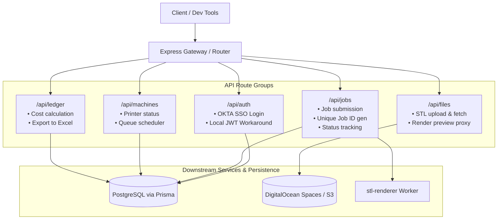

```mermaid
flowchart TD
    Client["Client / Dev Tools"] --> Router["Express Gateway / Router"]

    subgraph Endpoints ["API Route Groups"]
        Auth["/api/auth<br/>• OKTA SSO Login<br/>• Local JWT Workaround"]
        Jobs["/api/jobs<br/>• Job submission<br/>• Unique Job ID gen<br/>• Status tracking"]
        Files["/api/files<br/>• STL upload & fetch<br/>• Render preview proxy"]
        Machines["/api/machines<br/>• Printer status<br/>• Queue scheduler"]
        Ledger["/api/ledger<br/>• Cost calculation<br/>• Export to Excel"]
    end

    subgraph Services ["Downstream Services & Persistence"]
        DB[("PostgreSQL via Prisma")]
        S3[("DigitalOcean Spaces / S3")]
        Renderer["stl-renderer Worker"]
    end

    Router --> Auth
    Router --> Jobs
    Router --> Files
    Router --> Machines
    Router --> Ledger

    Auth --> DB
    Jobs --> DB
    Jobs --> Renderer
    Files --> S3
    Machines --> DB
    Ledger --> DB
```
