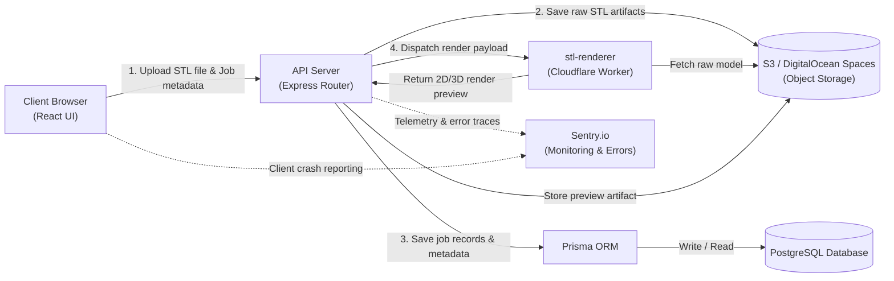

```mermaid
flowchart LR
    Client["Client Browser<br/>(React UI)"]
    API["API Server<br/>(Express Router)"]
    S3[("S3 / DigitalOcean Spaces<br/>(Object Storage)")]
    Worker["stl-renderer<br/>(Cloudflare Worker)"]
    Prisma["Prisma ORM"]
    DB[("PostgreSQL Database")]
    Sentry["Sentry.io<br/>(Monitoring & Errors)"]

    %% User Upload & Requests
    Client -->|"1. Upload STL file & Job metadata"| API
    
    %% Storage & Database Operations
    API -->|"2. Save raw STL artifacts"| S3
    API -->|"3. Save job records & metadata"| Prisma
    Prisma -->|"Write / Read"| DB

    %% Microservice Rendering
    API -->|"4. Dispatch render payload"| Worker
    Worker -->|"Fetch raw model"| S3
    Worker -->|"Return 2D/3D render preview"| API
    API -->|"Store preview artifact"| S3

    %% Monitoring
    API -.->|"Telemetry & error traces"| Sentry
    Client -.->|"Client crash reporting"| Sentry
```
