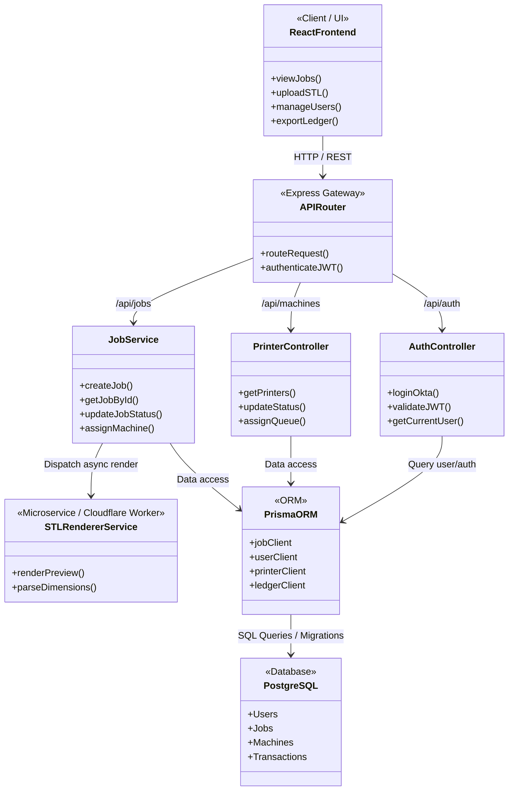

```mermaid
classDiagram
    direction TB

    class ReactFrontend {
        <<Client / UI>>
        +viewJobs()
        +uploadSTL()
        +manageUsers()
        +exportLedger()
    }

    class APIRouter {
        <<Express Gateway>>
        +routeRequest()
        +authenticateJWT()
    }

    class AuthController {
        +loginOkta()
        +validateJWT()
        +getCurrentUser()
    }

    class JobService {
        +createJob()
        +getJobById()
        +updateJobStatus()
        +assignMachine()
    }

    class PrinterController {
        +getPrinters()
        +updateStatus()
        +assignQueue()
    }

    class STLRendererService {
        <<Microservice / Cloudflare Worker>>
        +renderPreview()
        +parseDimensions()
    }

    class PrismaORM {
        <<ORM>>
        +jobClient
        +userClient
        +printerClient
        +ledgerClient
    }

    class PostgreSQL {
        <<Database>>
        +Users
        +Jobs
        +Machines
        +Transactions
    }

    ReactFrontend --> APIRouter : HTTP / REST
    APIRouter --> AuthController : /api/auth
    APIRouter --> JobService : /api/jobs
    APIRouter --> PrinterController : /api/machines
    JobService --> STLRendererService : Dispatch async render
    JobService --> PrismaORM : Data access
    PrinterController --> PrismaORM : Data access
    AuthController --> PrismaORM : Query user/auth
    PrismaORM --> PostgreSQL : SQL Queries / Migrations
```
