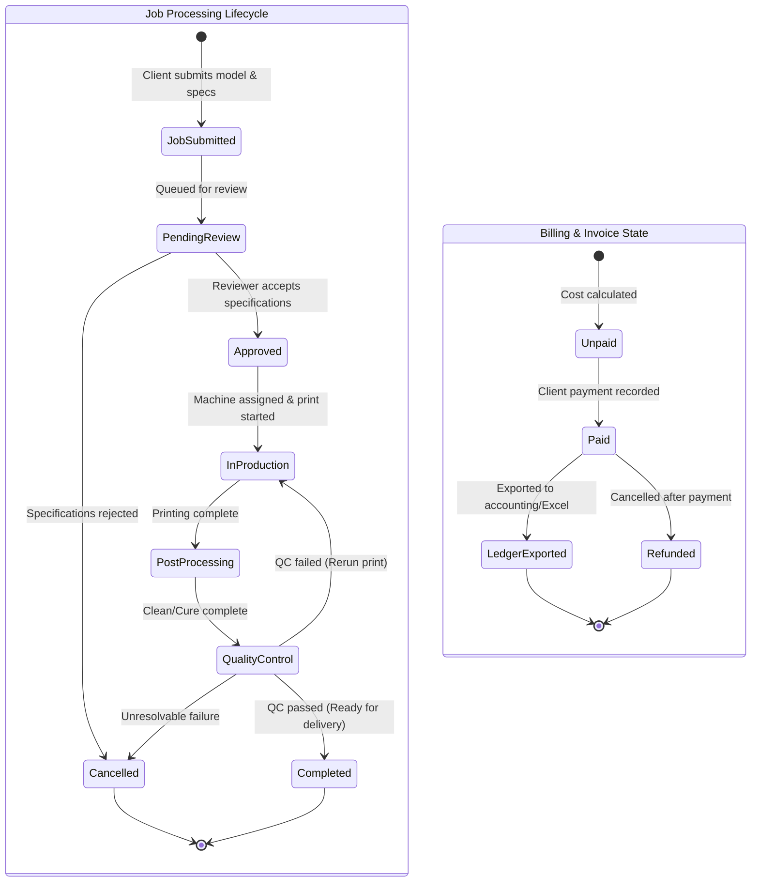

```mermaid
stateDiagram-v2
    direction TB

    state "Job Processing Lifecycle" as JobFlow {
        [*] --> JobSubmitted : Client submits model & specs
        JobSubmitted --> PendingReview : Queued for review
        
        PendingReview --> Approved : Reviewer accepts specifications
        PendingReview --> Cancelled : Specifications rejected

        Approved --> InProduction : Machine assigned & print started
        InProduction --> PostProcessing : Printing complete
        
        PostProcessing --> QualityControl : Clean/Cure complete
        
        QualityControl --> Completed : QC passed (Ready for delivery)
        QualityControl --> InProduction : QC failed (Rerun print)
        QualityControl --> Cancelled : Unresolvable failure

        Cancelled --> [*]
        Completed --> [*]
    }

    state "Billing & Invoice State" as BillingFlow {
        [*] --> Unpaid : Cost calculated
        Unpaid --> Paid : Client payment recorded
        Paid --> LedgerExported : Exported to accounting/Excel
        LedgerExported --> [*]

        Paid --> Refunded : Cancelled after payment
        Refunded --> [*]
    }
```
