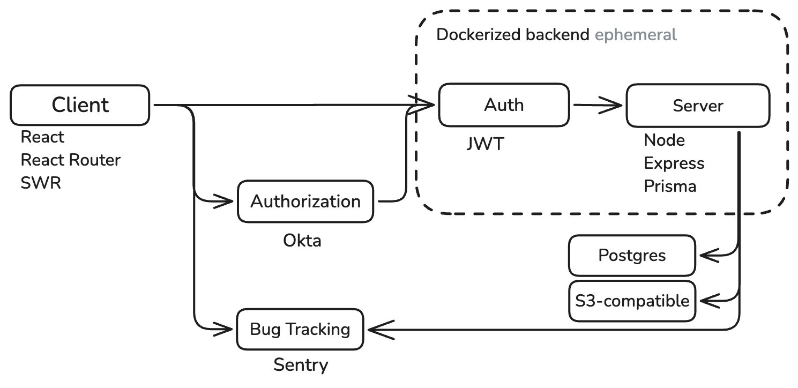
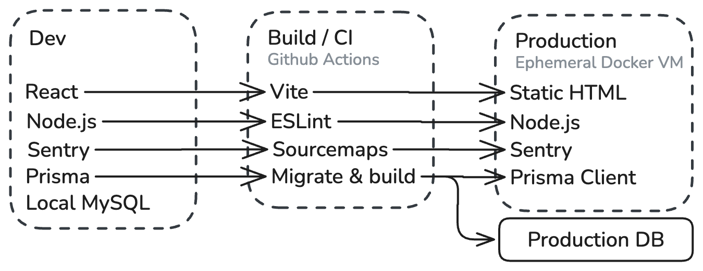

# SLU Open Project

- [SLU Open Project](#slu-open-project)
  - [Project Overview](#project-overview)
  - [System Architecture](#system-architecture)
  - [Deployment Architecture](#deployment-architecture)
  - [Security](#security)

## Project Overview
SLU Open Project is a tool built by a collaboration between the Saint Louis University Center for Additive Manufacturing and SLU Open Source. It is a platform for managing and tracking jobs to be submitted to shops across the SLU community. It is designed to be a simple one-stop-shop for shops to manage their workloads and to serve as a hub for users to submit jobs to these shops. Shops can recieve jobs from single users, or from billing groups of users that allow users to submit jobs to a shop, but to have their billing handled by a separate entity, like a department or lab.

It was originally built by Jack Crane (jack.crane@slu.edu) and is designed to be maintained by the SLU Open Source team. It is built using a modern stack of technologies and is designed to be easily maintainable and extendable. I have experience building and maintaining large-scale applications built with security and performance in mind, having "interned" for 16 months as one of 15 developers at a [white-label social media platform](https://apollos.app), built 3 internal tools for a fortune-500 company, a [server-side image generator](https://og-image.xyz) with over 10,000 MAU and over 2,000,000 images generated this year. All this to say, I have experience building and maintaining applications and have put great consideration into the futureproofing and maintainability of this application.

## System Architecture

The application is composed of the following high-level components:

- **Frontend**: The frontend is a web application that is served to the user's browser. It is responsible for rendering the user interface user interactions, and routing. The frontend is built using React and React Router. The frontend handles almost no logic.
- **Backend**: The backend is a RESTful API that is responsible for handling requests from the frontend, interacting with the database, validating requests, and performing business logic. The backend is built using Express and Node.js.
- **Database**: The database is a MySQL database that stores all the data for the application. The database is designed, made type-safe, and accessed with Prisma. Once moving to production, a production-level database will be provisioned and used. The database lives outside of the application container to ensure persistence and to allow for managed security, backups, scaling, and optimization.
- **Authentication & Authorization**: Authorization and initial authentication is handled by Okta. Once authenticated, the frontend and backend communicate using JWT tokens, cutting Okta out of the loop. JWT tokens remain valid for 3 hours before requiring the user to re-authenticate with their Okta credentials.

There are also a few external services that the application interacts with:

- **Okta**: Used for initial authentication and authorization.
- **UploadThing**: A managed file uploading & hosting provider. Uploads to UploadThing are done directly from the frontend with authorization handled by the backend. UploadThing provides a URL to the uploaded file via webhook that is stored in the database and provided to the frontend.
- **Postmark**: A managed email sending service. Postmark is used to send transactional emails to users regarding their account and jobs. Postmark is only accessed by the backend.
- **Sentry**: A managed error tracking service. Sentry is used to track errors occuring on the frontend (client-facing) application. It has access to sourcemap files provided by the build step. Sentry does not have access to any user data, files, or otherwise sensitive information not directly provided to the client.
- **Cloudflare**: Cloudflare is part of the current stack because I personally use it for DNS management and SSL certificates. It is not a critical part of the application and can be replaced with any other DNS provider and SSL certificate provider.

The application is deployed using a Docker container. It currently runs off of a DigitalOcean App Platform instance (DigitalOcean's managed kubernetes solution), but can be deployed to any solution capable of running Docker containers. The dockerized application is ephemeral and stateless, allowing for a complete failure of the application without significant data loss and immediate recovery.

## Deployment Architecture

- The React-powered frontend is built to static files using Vite and is made available to the frontend via a static file route.
- The node backend is run through a strict ESLint step ensuring code quality and consistency.
- Sourcemaps are uploaded to Sentry for up-to-date error tracking an stack trace information. This allows for quick debugging and resolution of issues while still providing users with vague error messages.
- Prisma is used to generate the database access library, ensuring type safety and consistency in database interactions. On the build process, Prisma runs a migration step to make sure the database and the live application are in sync.
- In development, a local MySQL database is used, preventing any accidental changes or damage to the production database and to ensure that the production database remains secure and consistent. Production database calls and queries are only done in emergencies or for recovery purposes.

## Security

- **Authentication & Authorization**: Authentication is handled by Okta. Once authenticated, the frontend and backend communicate using JWT tokens. JWT tokens are only valid for 3 hours before requiring the user to re-authenticate with their Okta credentials. JWT tokens are stored in LocalStorage and are not accessible by any other domain. JWT tokens are only sent over HTTPS and are compared against a user's IP address and user agent to prevent token theft. JWT tokens are signed and verified using a secret key stored in the backend. In the event of a security issue, the secret key can be rotated to invalidate all existing tokens and require every user to re-authenticate. If a user's token expires, they are redirected to a login page and subsequent or in-flight requests are rejected.
- **Data Protection**: All data is stored in a MySQL database. The database is accessed using Prisma, which provides type-safe access to the database. Prisma automatically sanitizes all inputs to prevent SQL injection attacks. The database is hosted on a managed service that provides security, backups, and scaling. The database is configured to only allow requests from recognized IP addresses and to require a password for access. Unauthorized requests are logged and reported.
- **File Uploads**: File uploads are handled by UploadThing. UploadThing provides a secure URL for the uploaded file that is stored in the database. File uploads are initiated by the frontend and authorized by the backend. As per [UploadThing's terms of service](https://uploadthing.com/info/terms-of-service), files are only accessible by SLU Open Project unless otherwise required by law. Files uploaded are not deleted unless a privileged user requests deletion explicitly or via a delete operation in the application.
- **Vulnerability Management**: The application is built using modern technologies and best practices. Dependencies are kept up-to-date using Dependabot, and attack surfaces are minimized by limiting the access scope of each user and verifying permissions before issuing any write commands or returning any sensitive data. The application is monitored using a logging solution and Sentry for error tracking. In the event of a security issue, the offending user can be suspended and reported, and access to the application can be limited by putting the database into a reject-all state.
- **Disaster recovery and Backup**: Disaster recovery and backup will be dependent on the final deployment solution, but in testing, database backups occur daily and are stored in a secure, read-only location. In the event of catastrophic system failure, the application will automatically roll back to the same image and attempt a restart. After multiple failed restarts, it will revert back to a known stable point. The codebase is tracked by git and all changes are tracked.
- **Third-party dependencies**: Following is a list of third-party dependencies used by the application, its purpose, and access level.
  - **Prisma**: Database access library. Prisma has full access to the application's data and is used to perform all database operations. Prisma is a critical dependency and is used in almost every part of the application. Prisma is a reputable ORM with a good track record of bug fixes and security patches.
  - **Express**: Web server framework. Express is used to facilitate incoming requests and their responses. Express is a massively popular and well-maintained library with a good track record of bug fixes and security patches.
  - **JSON Web Tokens**: JWT tokens are used to authenticate users. The JWT library is first-party by Auth0 and is given access to only the authentication header of requests.
  - **Puppeteer**: Puppeteer is used for server-side rendering. Puppeteer is a first-party library by Google and is used for rendering static pages (like invoices) to PDF on the server side.
  - **UploadThing**: The UploadThing library is used for signing file upload requests and for performing delete and modify operations on existing files.
  - **React**: React is used for building the frontend. React is a first-party library by Facebook and is used for rendering the user interface.
  - **React Router**: React Router is used for routing in the frontend.
  - **Remark**: Remark is used for markdown parsing in the frontend. Remark is well tested and is given extremely limited access to data and is situationally isolated from the rest of the application. `<script>` and `<style>` tags are disallowed to prevent JS and CSS injection attacks.
  - **SWR**: SWR is used for data fetching in the frontend. SWR is a first-party library by Vercel and is used for caching and fetching data from the backend. We use it sparingly for its caching capabilities and its ability to handle stale data. It is only used on non-critical and non-sensitive data.
  - **Three**: Three is used for rendering 3D models in the frontend. Three is a first-party library by the Three.js team and is used for rendering 3D models in the browser. Three is given access to the canvas element and file URLs.
  - **Moment**: Moment is used for date formatting in the frontend. Moment is a well-tested library and is given access to only the date and time fields of the application.