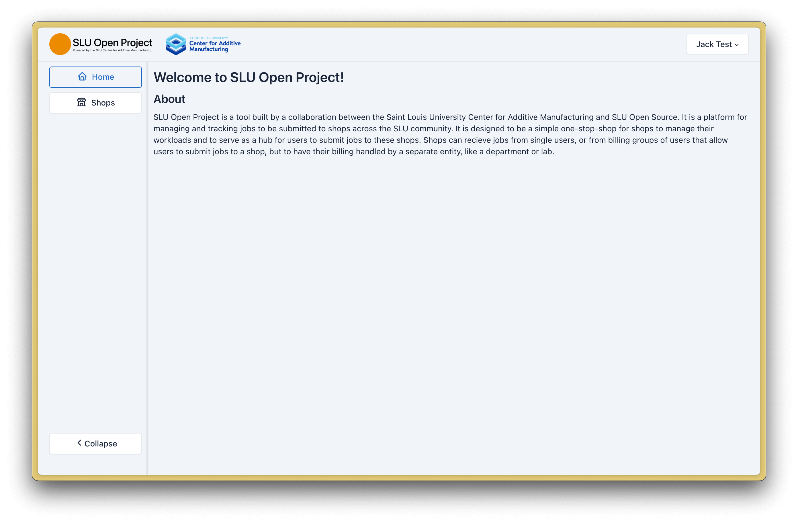

<!-- eslint no-use-before-define: 0 -->

# SLU Open Project

## Introduction

SLU Open Project is a tool built by a collaboration between the Saint Louis University Center for Additive Manufacturing and SLU Open Source. It is a platform for managing and tracking jobs to be submitted to shops across the SLU community. It is designed to be a simple one-stop-shop for shops to manage their workloads and to serve as a hub for users to submit jobs to these shops. Shops can recieve jobs from single users, or from billing groups of users that allow users to submit jobs to a shop, but to have their billing handled by a separate entity, like a department or lab.

## Table of Contents

[Introduction](#introduction)\
[Table of Contents](#table-of-contents)\
[Objectives & Features](#objectives--features)\
[Vocabulary](#vocabulary)

## Objectives & Features

- **Shop Management**: Shops can be created and managed autonomously by shop admins with the least amount of support overhead.
- **Job Management**: Users can submit jobs to shops and track the status of their jobs. Job admins and operators can manage submitted jobs, access files, leave comments, and update their status.
- **Billing Management**: Manages a billing system that tracks a ledger of transactions for each shop member, allowing users to pay for their jobs.
- **Group Billing**: Allows users to submit jobs to a shop, but have their billing handled by a separate entity, like a department or lab.

## Vocabulary

| Term | Definition |
| --- | --- |
| Shop | A shop is a managed site that fulfills orders and jobs. It is usually one entity that manages its own machines, materials, billing, and staffing. |
| Job | A job is a request for service that a shop can fulfill. It is a record of a user's request for a service. |
| Job Item | A job item is a single item in a job. A job can have multiple job items. A job item has individual pricing information that is aggregated to calculate the job's price. A single job item is created by uploading a file. |
| User | A user is a person who interacts with the system. A user is not inherently a shop member. |
| Shop Member | A shop member is a user who is a member of a shop. Shop members can submit jobs to the shop and have access to the shop's services. Shop members are also users who work in a shop and have access to view content with the shop. A user can be a member of multiple shops. Each shop member has an *account type* that can be set to `admin`, `operator`, `user`, or `group admin` |
| Shop Admin | A shop admin is a shop member who has the ability to manage the shop. Shop admins can do all the things that members and operators can do, but they can also manage the shop's settings and members. |
| Shop Operator | A shop operator is a shop member who has the ability to view and manage jobs. Shop operators can do all the things that members can do, but they can also manage jobs. |
| Group Admin | A group admin is a shop member who has the ability to create manage a billing group. Group admins can do all the things that members can do, but they can also create billing groups. This is intended for professors, lab admins, and departments. |
| Billing Group | A billing group is a group of users who can submit jobs to a shop, but have their billing handled by a separate entity, like a department or lab. |
| Status | The status of a job item or job. A status is a string that describes the current state of a job item or job. Can be `Not Started`, `In Progress`, `Completed`, `Waiting`, `Cancelled`, `Won't Do`, `Waiting for Pickup`, and `Waiting for Payment`. |
| Resource Type | A broad category of resource that a shop can provide. This is configurable by the shop admin, but could include things like `3D Printing`, `Laser Cutting`, `CNC`, `Vinyl Printing`, `Shop tools`, `Staff time` etc. |
| Resource | A specific resource that a shop provides. This should be a specific machine or service that the shop provides. This is configurable by the shop admin, but could include things like `Bambu Lab P1S`, `JET Milling Machine`, `Engineering Time`, etc. |
| Material | A material that a shop provides. This is configurable by the shop admin, but could include things like `PLA`, `ABS`, `Wood`, `Metal`, etc. Materials are assigned to a resource type. |

## Shops

Users can be added to many shops, and are either a shop member or a shop admin. Shop members can submit jobs to the shop, and shop admins can manage the shop and its members. Shop admins can also manage the shop's settings, such as the shop's name, description, and billing settings.

### Jobs

The jobs page is a list of all the jobs that have been submitted to the shop that the user has access to. Jobs are filterable by status, due date, and finalization state, and have configurable columns.

| Column | Description | Who can modify |
| --- | --- | --- |
| Title | The title of the job | Anyone |
| Submitter | The user who submitted the job. In the case of a billing group, this is the group admin. | System |
| Description | A description of the job | Anyone |
| Total Cost | The total cost of the job, aggregated from job items and additional cost line items. | Admin & Operator |
| Affordability | Whether or not the user can afford the job given its current cost and the user's current balance. | System, based on "total cost" |
| Items | The number of job items of any status in the job | System |
| Progress | A quick look at the progress of job items. Includes the total number of job items, a count of job items grouped by status, and a pie chart describing status. | Admin & Operator |
| Status | The status of the job. Refer to the *status* row of vocabulary for a list of possible statuses | Admin & Operator |
| Finalized | Whether or not the job has been finalized. A job is finalized when an admin or operator marks it as finished. When finalized, the user is billed for the job. | Admin & Operator |
| Finalized At | The date the job was finalized | System |
| Created At | The date the job was created | System |

*Anyone* means anyone who already has access to the job, not just anyone who has access to the shop or the platform.\
*System* means that the system automatically sets this value and it cannot be modified.

### Job & Job Items

A job is a request for service that a shop can fulfill. It is a record of a user's request for a service. A job can have multiple job items. A job item is a single item in a job. A job item has individual pricing information that is aggregated to calculate the job's price. A single job item is created by uploading a file.

Anyone with access to the job can upload files which generates a new job item. Files can be any file type, but only certain file types are supported for viewing. If the file is not supported, the user can always download the file and view it.

This screenshot is crom the perspective of the submitter, a user without admin or operator permissions. The submitter is able to select the resource type and material, but the exact resource is selected by the admin or operator. The user is also able to request specific resource types or materials on each individual job item. They can also see the status of the job and each item, but cannot modify them.

The comments tab is a place for submitters and staff to communicate about the job. Comments are very simple and are just text. They are not threaded or nested. Comments are visible to all users who have access to the job and are not able to be edited or deleted.

The costing tab is a place for admins and operators to manage the cost of the job. The cost of the job is calculated by aggregating the cost of each job item. It is also possible to include project-wide costs that are not associated with a specific job item. These costs could be things like global machine costs rather than per-item, or additional costs like staff time, extra materials or anything else that should be included in the cost of the job.

It is possible to configure additional costs to be added to or put in place of the item-based costing.

### Billing

Billing is handled by a ledger system. Each shop member has a ledger that tracks their transactions. Transactions can be positive or negative, and are created by the system when a job is finalized. The user's balance is the sum of all transactions. In the table, users are invited to download their invoices or be linked to their projects.

The actual value of a user's balance is not stored in the database, but is calculated by summing all transactions. This is to prevent rounding errors and to ensure that the balance is always accurate.

Ledger items like manual deposits and topoffs can be posted from the users page in the shop (not depicted in this screenshot). Users can also get an initial deposit when they are first added to the shop. This is configured in the shop settings.

Users can go into negative balance and will not be restricted from submitting jobs, but they will get a warning and a notice will be placed on their jobs.